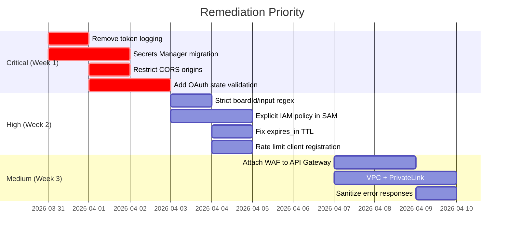

# 🔒 Security Audit Report — Netz-Miro-MCP

**Audit Date:** 2026-03-30  
**Scope:** Full codebase (`src/`, [template.yaml](file:///Users/dmitrikonnov/Dev/work/Netz-Miro-MCP/template.yaml), `.github/`, [package.json](file:///Users/dmitrikonnov/Dev/work/Netz-Miro-MCP/package.json))  
**Auditor Role:** Cyber Security Engineer (Adversarial, Zero Trust)  
**Status:** Diagnostic Mode Activated (`audit` keyword)

---

## Executive Summary

The Netz-Miro-MCP server is an AWS Serverless (SAM) application that exposes Miro board operations via two Lambda functions: a REST API and an MCP (Model Context Protocol) server with an OAuth proxy. The audit identified **4 Critical**, **5 High**, and **4 Medium** severity findings.

The most severe risks stem from **OAuth client secret exposure in CloudFormation plaintext parameters**, a **missing CSRF/state validation in the OAuth authorization proxy**, **wildcard CORS headers**, and **sensitive token data logged to CloudWatch in plaintext**.

---

## Findings Summary

| # | Severity | Category | Finding |
|---|----------|----------|---------|
| 1 | 🔴 CRITICAL | Secrets Management | OAuth `client_secret` passed as plaintext CFN parameter |
| 2 | 🔴 CRITICAL | OAuth Security | Missing `state` parameter validation (CSRF) |
| 3 | 🔴 CRITICAL | Information Disclosure | Bearer tokens and OAuth response bodies logged to CloudWatch |
| 4 | 🔴 CRITICAL | Transport Security | Wildcard CORS (`Access-Control-Allow-Origin: *`) on token + MCP endpoints |
| 5 | 🟠 HIGH | OAuth Security | Dynamic Client Registration open without authentication |
| 6 | 🟠 HIGH | IAM / Least Privilege | SAM-generated IAM roles use implicit broad permissions |
| 7 | 🟠 HIGH | MCP Tool Security | No input sanitization on LLM-generated `boardId` / `content` arguments |
| 8 | 🟠 HIGH | OAuth Security | Fixed `expires_in` override to 1 year removes token rotation |
| 9 | 🟠 HIGH | Network Isolation | Lambda not deployed in VPC; no PrivateLink endpoints |
| 10 | 🟡 MEDIUM | API Gateway | No WAF attached to HttpApi |
| 11 | 🟡 MEDIUM | API Gateway | No request throttling/rate limiting configured |
| 12 | 🟡 MEDIUM | Error Handling | Internal error messages leaked to client |
| 13 | 🟡 MEDIUM | CLI Entry Point | OAuth token accepted via CLI `--token` argument (visible in `ps`) |

---

## Detailed Findings

### 🔴 FINDING 1 — OAuth Client Secret in Plaintext CFN Parameter

> [!CAUTION]
> The `MIRO_CLIENT_SECRET` is passed as a SAM `Parameter` and injected directly into a Lambda environment variable. Although `NoEcho: true` hides it from CFN console output, the value is stored **in plaintext** in the Lambda environment configuration and is retrievable via `aws lambda get-function-configuration`.

- **File:** [template.yaml](file:///Users/dmitrikonnov/Dev/work/Netz-Miro-MCP/template.yaml#L24-L28) (Parameter definition)  
- **File:** [template.yaml](file:///Users/dmitrikonnov/Dev/work/Netz-Miro-MCP/template.yaml#L131-L134) (Env var injection)  
- **Attack Vector:** Any principal with `lambda:GetFunctionConfiguration` can extract the secret.  
- **CVSS:** 9.1

**Remediation — Use AWS Secrets Manager:**

```hcl
# Terraform declarative patch
resource "aws_secretsmanager_secret" "miro_client_secret" {
  name       = "mcp/miro/client-secret"
  kms_key_id = aws_kms_key.mcp_secrets_key.arn
}

# Lambda reads at runtime via SDK, NOT from env vars
```

Remove `MIRO_CLIENT_SECRET` from `Environment.Variables` entirely. Retrieve at runtime:

```typescript
import { SecretsManagerClient, GetSecretValueCommand } from "@aws-sdk/client-secrets-manager";
const sm = new SecretsManagerClient({});
const { SecretString } = await sm.send(
  new GetSecretValueCommand({ SecretId: "mcp/miro/client-secret" })
);
```

---

### 🔴 FINDING 2 — Missing OAuth `state` Parameter Validation (CSRF)

> [!CAUTION]
> The `/oauth/authorize` endpoint blindly forwards all query parameters to Miro without generating or validating a `state` parameter. This enables classic OAuth CSRF attacks where an attacker can force a victim to authorize an account controlled by the attacker.

- **File:** [mcp/lambda.ts](file:///Users/dmitrikonnov/Dev/work/Netz-Miro-MCP/src/mcp/lambda.ts#L214-L247)
- **Attack Vector:** Attacker crafts a malicious authorize URL → victim clicks → victim's MCP session is tied to attacker's Miro account.
- **CVSS:** 8.1

**Remediation:**

```typescript
// Generate and validate state
import { randomBytes } from 'crypto';

// In /oauth/authorize:
const state = randomBytes(32).toString('hex');
// Store state in a short-lived token (signed JWT or DynamoDB TTL entry)
miroAuthUrl.searchParams.set('state', state);

// In /oauth/token — validate state before exchange
```

---

### 🔴 FINDING 3 — Sensitive Token Data Logged to CloudWatch

> [!CAUTION]
> The MCP Lambda handler logs Bearer tokens and the full Miro token exchange response body (which contains the `access_token`) to CloudWatch Logs in plaintext.

- **File:** [mcp/lambda.ts:349](file:///Users/dmitrikonnov/Dev/work/Netz-Miro-MCP/src/mcp/lambda.ts#L349) — `console.log('[mcp] Bearer token present, body:', rawBody.slice(0, 500));`
- **File:** [mcp/lambda.ts:291](file:///Users/dmitrikonnov/Dev/work/Netz-Miro-MCP/src/mcp/lambda.ts#L291) — `console.log('[mcp] Miro token response body:', miroResponseBody);` — **This logs the full access_token.**
- **File:** [mcp/lambda.ts:265](file:///Users/dmitrikonnov/Dev/work/Netz-Miro-MCP/src/mcp/lambda.ts#L265) — Logs raw `/oauth/token` request body.
- **CVSS:** 8.6

**Remediation:**

```typescript
// REMOVE all plaintext token logging. Replace with:
console.log('[mcp] Miro token response status:', miroResponse.status);
// DO NOT log miroResponseBody or rawBody containing tokens
// If debugging is needed, log only non-sensitive metadata:
console.log('[mcp] token exchange succeeded, token_type:', tokenData.token_type);
```

---

### 🔴 FINDING 4 — Wildcard CORS on Sensitive Endpoints

> [!CAUTION]
> Both the SAM [template.yaml](file:///Users/dmitrikonnov/Dev/work/Netz-Miro-MCP/template.yaml) and the MCP Lambda hardcode `Access-Control-Allow-Origin: *`. This allows any origin to make authenticated requests to the OAuth token endpoint and MCP protocol endpoints.

- **File:** [template.yaml:41-42](file:///Users/dmitrikonnov/Dev/work/Netz-Miro-MCP/template.yaml#L40-L42) — `AllowOrigins: ["*"]`
- **File:** [mcp/lambda.ts:118](file:///Users/dmitrikonnov/Dev/work/Netz-Miro-MCP/src/mcp/lambda.ts#L118) — `'Access-Control-Allow-Origin': '*'`
- **File:** [mcp/lambda.ts:312](file:///Users/dmitrikonnov/Dev/work/Netz-Miro-MCP/src/mcp/lambda.ts#L312) — Same on token response.
- **CVSS:** 7.5

**Remediation — Restrict to known origins:**

```yaml
# template.yaml
CorsConfiguration:
  AllowOrigins:
    - "https://your-mcp-client.example.com"
  AllowMethods:
    - POST
    - OPTIONS
  AllowHeaders:
    - Authorization
    - Content-Type
  AllowCredentials: true
```

---

### 🟠 FINDING 5 — Unauthenticated Dynamic Client Registration

The `/oauth/register` endpoint accepts any POST body without authentication and returns a valid `client_id`. While the `client_id` is a proxy identifier (the real Miro credentials are server-side), this enables enumeration and DOS through mass registration.

- **File:** [mcp/lambda.ts:184-207](file:///Users/dmitrikonnov/Dev/work/Netz-Miro-MCP/src/mcp/lambda.ts#L184-L207)
- **CVSS:** 6.5

**Remediation:** Implement rate limiting (WAF or API Gateway throttle) and consider requiring a pre-shared token or HMAC signature for registration.

---

### 🟠 FINDING 6 — Implicit Broad IAM Roles (SAM Default)

The [template.yaml](file:///Users/dmitrikonnov/Dev/work/Netz-Miro-MCP/template.yaml) uses `AWS::Serverless::Function` without an explicit `Policies` or `Role` property. SAM auto-generates a role with `AWSLambdaBasicExecutionRole`, but the implicit role boundary is not constrained.

- **File:** [template.yaml:52-123](file:///Users/dmitrikonnov/Dev/work/Netz-Miro-MCP/template.yaml#L52-L123)
- **CVSS:** 6.8

**Remediation:**

```yaml
MiroMcpFunction:
  Properties:
    Policies:
      - Version: "2012-10-17"
        Statement:
          - Effect: Allow
            Action:
              - logs:CreateLogStream
              - logs:PutLogEvents
            Resource: !Sub "arn:aws:logs:${AWS::Region}:${AWS::AccountId}:log-group:/aws/lambda/${AWS::StackName}-*"
          - Effect: Allow
            Action:
              - secretsmanager:GetSecretValue
            Resource: !Sub "arn:aws:secretsmanager:${AWS::Region}:${AWS::AccountId}:secret:mcp/*"
```

---

### 🟠 FINDING 7 — No Input Sanitization on LLM-Generated MCP Tool Arguments

MCP tool arguments (`boardId`, `content`, `frameId`) are passed directly from the LLM to the Miro API without server-side validation beyond Zod type checks. The `boardId` is a `z.string()` with no format constraint, opening path traversal/injection risks.

- **File:** [schemas.ts:89](file:///Users/dmitrikonnov/Dev/work/Netz-Miro-MCP/src/schemas.ts#L89) — `boardId: z.string()`
- **File:** [MiroClient.ts:205](file:///Users/dmitrikonnov/Dev/work/Netz-Miro-MCP/src/MiroClient.ts#L205) — `boardId` interpolated directly into URL path.
- **Attack Vector (Prompt Injection → SSRF):** A prompt injection could instruct the LLM to call `get_frames` with `boardId` = `../../v1/oauth-token?` to attempt path manipulation on the Miro API domain.
- **CVSS:** 7.2

**Remediation:**

```typescript
// Add strict boardId validation
const boardIdRegex = /^[a-zA-Z0-9_=-]+$/;
boardId: z.string().regex(boardIdRegex, "Invalid board ID format")
```

---

### 🟠 FINDING 8 — Fixed `expires_in` Override to 1 Year

The token proxy overrides Miro's `expires_in: 0` with `31536000` (1 year), effectively disabling token rotation.

- **File:** [mcp/lambda.ts:299-301](file:///Users/dmitrikonnov/Dev/work/Netz-Miro-MCP/src/mcp/lambda.ts#L299-L301)
- **CVSS:** 6.0

**Remediation:** Set a reasonable TTL (e.g., `3600` — 1 hour) and implement a `refresh_token` flow.

---

### 🟠 FINDING 9 — No VPC / Network Isolation

Both Lambda functions are deployed outside a VPC. All outbound traffic transits the public internet without PrivateLink or egress filtering.

- **File:** [template.yaml](file:///Users/dmitrikonnov/Dev/work/Netz-Miro-MCP/template.yaml) — No `VpcConfig` on either function.
- **CVSS:** 5.3

**Remediation:**

```yaml
MiroMcpFunction:
  Properties:
    VpcConfig:
      SubnetIds:
        - !Ref PrivateSubnetA
        - !Ref PrivateSubnetB
      SecurityGroupIds:
        - !Ref McpLambdaSG
```

---

### 🟡 FINDING 10 — No WAF on API Gateway

No `AWS::WAFv2::WebACL` is associated with the `MiroRestApi`. The API is exposed to the public internet without request inspection, bot protection, or IP-based filtering.

- **CVSS:** 5.0

---

### 🟡 FINDING 11 — No API Gateway Throttling

The `AWS::Serverless::HttpApi` has no `DefaultRouteSettings` for throttling. While `ReservedConcurrentExecutions: 50` provides a Lambda-level ceiling, there are no per-client or per-route rate limits.

- **CVSS:** 5.0

---

### 🟡 FINDING 12 — Internal Error Messages Leaked to Clients

The catch blocks in both Lambda handlers return raw error messages (including Miro API error text) to the caller:

- **File:** [rest/handler.ts:225-234](file:///Users/dmitrikonnov/Dev/work/Netz-Miro-MCP/src/rest/handler.ts#L224-L234)
- **File:** [mcp/lambda.ts:324-326](file:///Users/dmitrikonnov/Dev/work/Netz-Miro-MCP/src/mcp/lambda.ts#L324-L326) — Leaks Miro token exchange error details.

---

### 🟡 FINDING 13 — CLI Token Passed as Argument

The [index.ts](file:///Users/dmitrikonnov/Dev/work/Netz-Miro-MCP/src/index.ts) stdio entrypoint accepts `--token` via CLI argument, which is visible in `ps aux` output on shared systems.

- **File:** [index.ts:37](file:///Users/dmitrikonnov/Dev/work/Netz-Miro-MCP/src/index.ts#L37)
- **CVSS:** 4.0

**Remediation:** Prefer environment variable (`MIRO_OAUTH_TOKEN`) exclusively. Add a deprecation warning for `--token`.

---

## Positive Security Controls Observed

| Control | Status | Source |
|---------|--------|--------|
| Dependabot (npm + Actions) | ✅ Enabled | [dependabot.yml](file:///Users/dmitrikonnov/Dev/work/Netz-Miro-MCP/.github/dependabot.yml) |
| CodeQL (JS/TS + Actions) | ✅ Enabled | [security.yml](file:///Users/dmitrikonnov/Dev/work/Netz-Miro-MCP/.github/workflows/security.yml) |
| `npm audit` (weekly + on PR) | ✅ Enabled | [security.yml](file:///Users/dmitrikonnov/Dev/work/Netz-Miro-MCP/.github/workflows/security.yml) |
| OIDC for AWS deploy (no static keys) | ✅ Enabled | [deploy-lambda.yml](file:///Users/dmitrikonnov/Dev/work/Netz-Miro-MCP/.github/workflows/deploy-lambda.yml) |
| `.env*` in [.gitignore](file:///Users/dmitrikonnov/Dev/work/Netz-Miro-MCP/.gitignore) | ✅ Enabled | [.gitignore](file:///Users/dmitrikonnov/Dev/work/Netz-Miro-MCP/.gitignore) |
| `NoEcho: true` on secret CFN param | ⚠️ Partial | template.yaml (masks console only, not runtime) |
| Zod input validation on MCP tools | ⚠️ Partial | schemas.ts (type checks only, no format/length on IDs) |
| Bearer token required for MCP ops | ✅ Enabled | mcp/lambda.ts L334-345 |

---

## Priority Remediation Roadmap



---

*End of Report. All remediations are specified as declarative security patches. Diagnostic Mode deactivated.*
